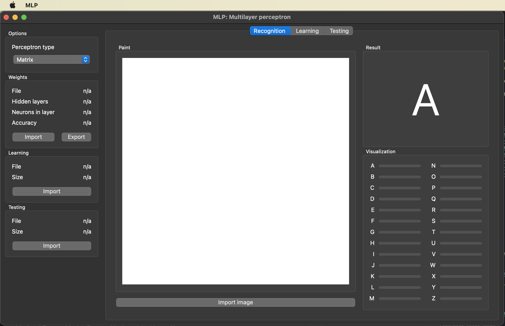
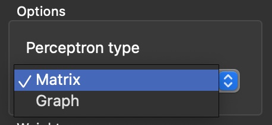
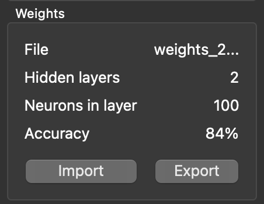
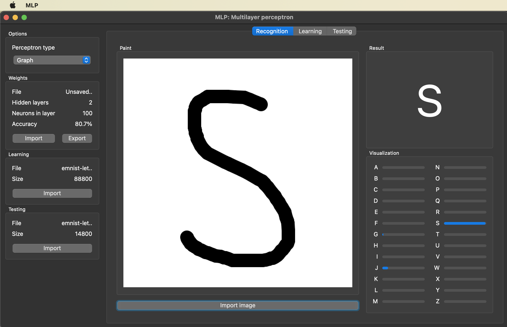
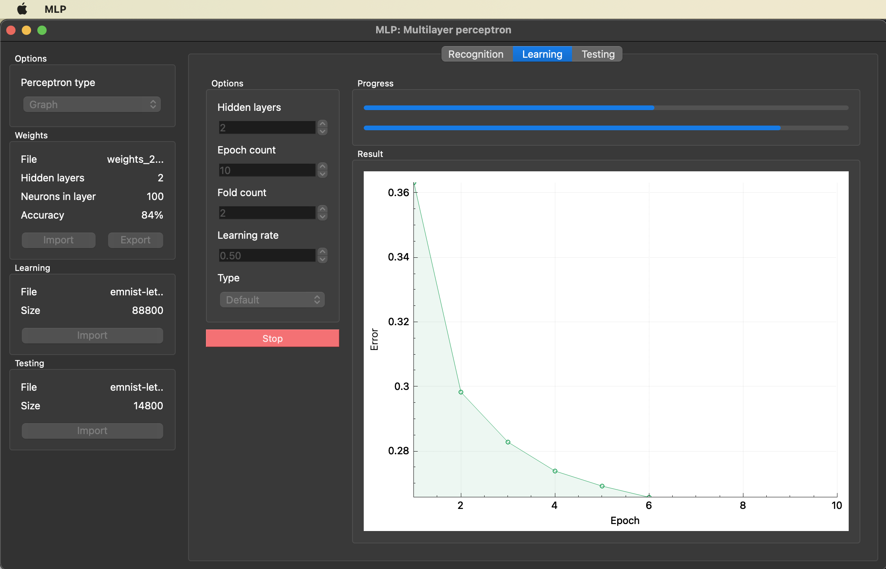
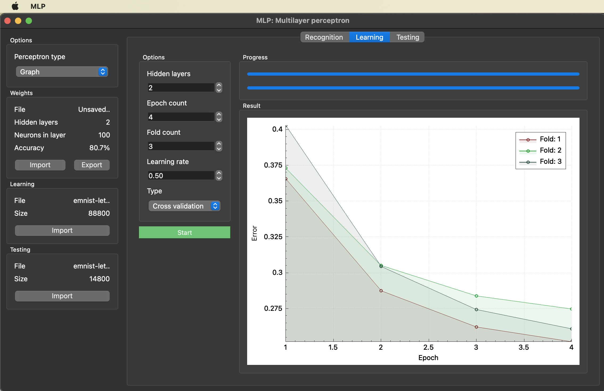
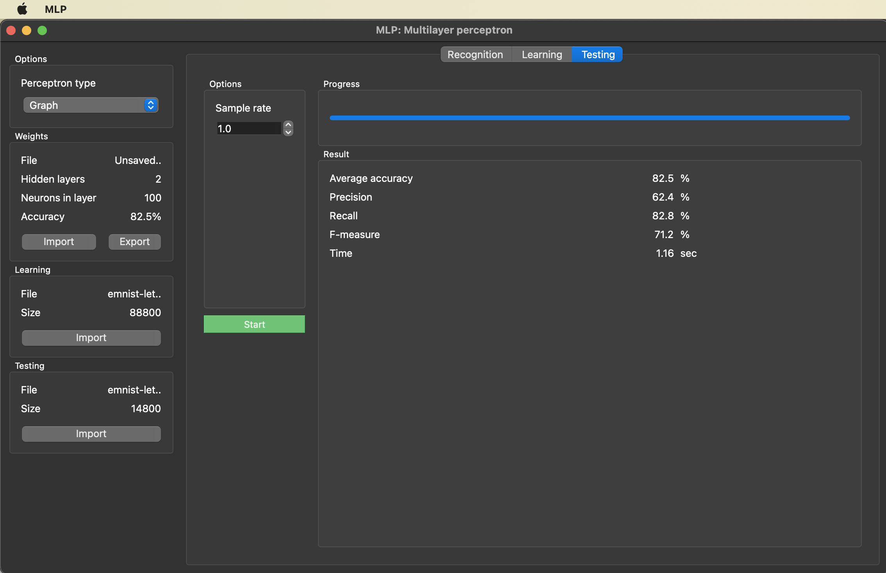

# Multilayer Perceptron

Implimentation of a simple artificial neural network in the form of a perceptron with sigmoid activation function, which must be trained on an open dataset and perform recognition of 26 handwritten letters of the Latin alphabet.

## Contents

1. [Chapter I](#chapter-i) \
   1.1. [Building](#building)
2. [Chapter II](#chapter-ii) \
   2.1. [Start](#start) \
   2.1. [Recognittion](#recognittion) \
   2.1. [Learning](#learning) \
   2.1. [Testing](#testing)

## Chapter I

## Building

To builld project `make` and `cmake` must be installed. 

Go to project_directory/src in terminal and run `make`. It will start building the project in the build directory using cmake. After that, the program will automatically start.

If you see the output above - everything is correct and the program works just fine.

## Chapter II

## Start
By default, the underlying MLP has random weights, so it won't make any useful prediction. You can switch MLP between `graph` and `matrix` implementations (matrix is the default).

You can also upload your own weights, but they must match the template:
   1. Configuration: 
   - Input layer - 784 neurons
   - Any number of hidden layers - 100 neurons
   - Output layer - 26 neurons
   2. Weights (double)
   3. Biases (double)

To load weights, click the `Import` button in the weights area. There are trained weights in the project `weights` catalog.

After loading, the weight information will be updated:

You can also download weights from the program to the selected file.

## Recognittion

In the `Recognition` tab, you can draw a letter, the predicted result will be shown in the `Results` area.

You can also upload an image in bmp format.

Right-click to clear the drawing area.

## Learning

Before you start training, you need to download the training and test datasets (you will find the MNIST open dataset in the `datasets` directory) by clicking `Import` buttin in certain areas. Wait for them to load.
Then you can choose: 
 - How many hidden layers your new MLP will have
 - How many epochs your new MLP will go through
 - Specify the learning rate.
 - Specify learning type
 - Specify fold amount (only for cross validation learning type)

After that press the `Start` button and the learning process will run. You can monitor the progress in the progress bar above. You can also observe the MLP error at the end of each epoch on the graph.

If you want to stop process prematurely click `Stop` button. In this case the old MLP will not be overwritten by the new one.

In the case of cross validation, the MLP with better metrics will be written instead of the old MLP.

At the end, the weight information area will be updated. 

## Testing

Before you start testing, you need to download the  test datasets (you will find the MNIST open dataset in the `datasets` directory) by clicking `Import` buttin in certain areas. Wait for it to load.
Then you can specify: 
 - Sample rate (which part of test data will be tested, 1.0 by default)

After that press the `Start` button and the testing process will run. You can monitor the progress in the progress bar above.

If you want to stop process prematurely click `Stop` button. 

At the end, the MLP metricx will be shown.

